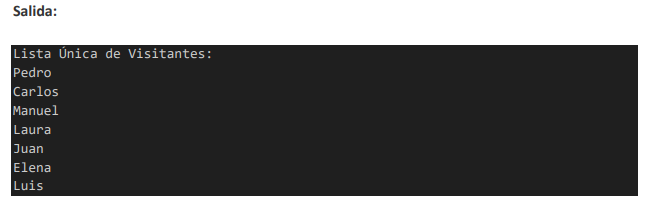

El administrador de un museo en París requiere llevar un registro de los visitantes que han recorrido las tres salas por las que se encuentra constituido (sala 1, sala 2 y sala 3). Algunos visitantes pueden haber pasado por más de una sala.
Se necesita una solución que permita registrar los nombres de los visitantes y determinar una lista única que contenga a todos los visitantes que han estado en alguna de las salas del museo.

El programa constará de las siguientes funcionalidades:
• Registro: los nombres de los visitantes se almacenan por cada sala y luego se debe obtener una lista única de todos los visitantes que han pasado por alguna de las salas.
• Un ejemplo del resultado final con los datos de pruebas usados es:

A continuación, responde las siguientes preguntas:
1. Explica las colecciones de datos en Python, considerando las listas y tuplas, y menciona cuáles de ellas no serían adecuadas para usar en el caso del museo. Justifica la exclusión de cada tipo de colección de datos en relación con el seguimiento de los visitantes en el museo.
2. ¿Cuál es la estructura de datos más adecuada para mantener un registro de los visitantes en diferentes salas del museo y obtener una lista única de todos los visitantes que han estado en alguna sala? Justifica su selección.
3. Desarrolle un programa en Python que satisfaga los requerimientos del museo. Incluye el código fuente completo y una captura de pantalla que muestre la salida después de ejecutar el programa con los datos de prueba utilizados.