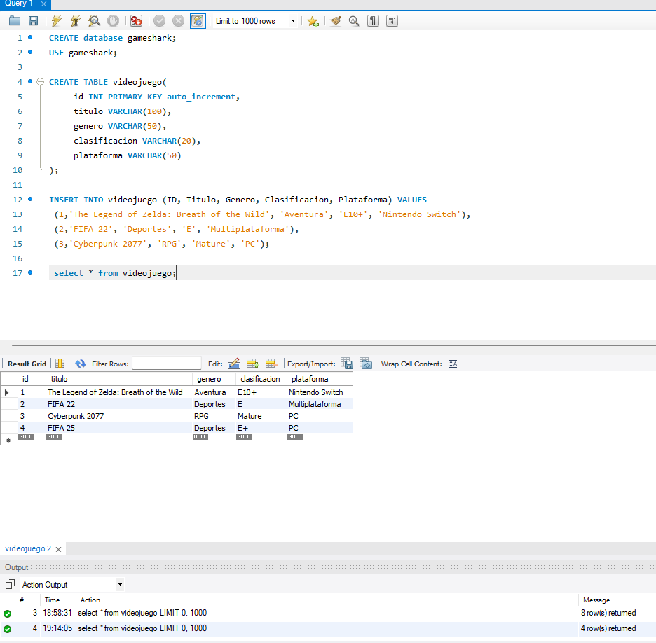
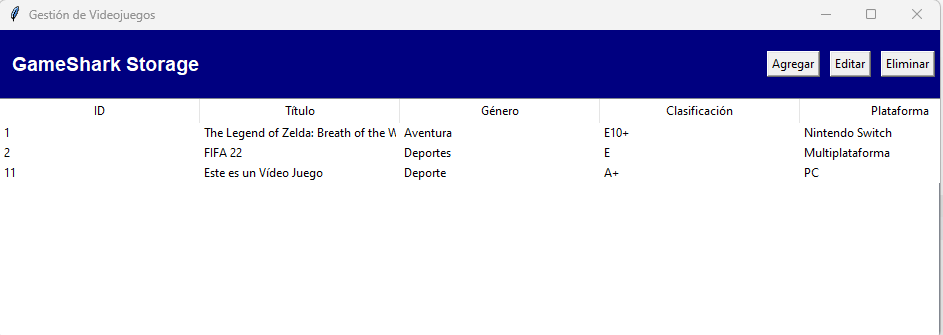
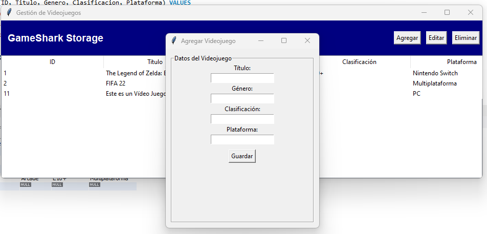

# Python CRUD
## Semana 8

### Requisitos
- Base de datos MySQL
- Frontend con Tkinter
- Backend con Python
- Leer, Escribir, Editar y Eliminar en las entidades
- Persistencia de Datos

### Contexto

Se necesita desarrollar una aplicación de escritorio utilizando Python y Tkinter para gestionar información sobre los videojuegos. Además, deberás
implementar operaciones básicas como agregar, mostrar, eliminar y actualizar información en la base de datos.

## Cómo lanzar el programa

Esta aplicación de escritorio permite gestionar una base de datos de videojuegos utilizando Python y MySQL, bajo una arquitectura MVC.

---

### 📦 Requisitos

Antes de ejecutar el programa, asegúrate de tener instalados los siguientes componentes:

- **Python 3.x**
- **MySQL Server** funcionando localmente
- **Base de datos `gameshark` creada**
- **Paquete de conexión a MySQL:**

```bash
pip install mysql-connector-python
```

---

### 🚀 Pasos para ejecutar la aplicación

#### 1. Clona o descarga el proyecto

Puedes hacerlo desde GitHub o desde una carpeta local. Asegúrate de tener todos los archivos `.py` y carpetas necesarias.

#### 2. Verifica la base de datos

Asegúrate de que MySQL esté ejecutándose y que la base de datos `gameshark` esté creada junto con la tabla `videojuegos`. Si no, puedes crearla con el siguiente script:

```sql
CREATE DATABASE gameshark;
USE gameshark;

CREATE TABLE videojuegos (
    id INT AUTO_INCREMENT PRIMARY KEY,
    titulo VARCHAR(100) NOT NULL,
    genero VARCHAR(50) NOT NULL,
    clasificacion VARCHAR(10) NOT NULL,
    plataforma VARCHAR(50) NOT NULL
);
```

---

## Imágenes



